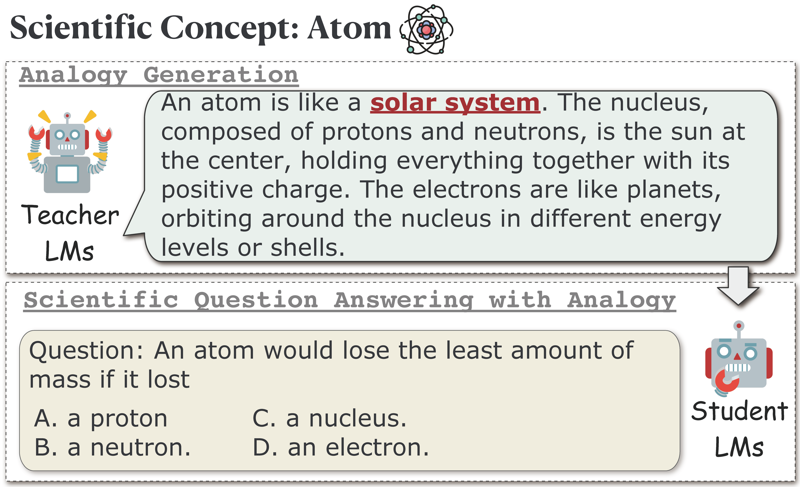

<p align="center">
     <br>
</p>
<h1 align="center">Boosting Scientific Concepts Understanding: Can Analogies from Teacher Models Empower Student Models? </h1>


# SCUA [<a href="http://arxiv.org/abs">Paper</a>] 

Drawing on principles of human education, we propose the SCUA, i.e., **S**cientific **C**oncept **U**nderstanding with **A**nalogy task, which aims to investigate whether analogies generated by teacher LMs can assist student LMs in understanding scientific concepts.

## Analogy Type

| **Scientific Concept** | Thermal Equilibrium|
|---------------------------------------------| ----- |
| **Free-Form Analogy**                       | Imagine a group of children, each holding a different number of balloons and standing in a room. Over time, they start trading balloons to balance out their amounts until each child is holding roughly the same number. Thermal equilibrium works similarly with temperature. If you place a hot object and a cold object close together, heat (like the balloons) will transfer from the hot object to the cold one until both objects reach the same temperature. At this point, they are in thermal equilibrium, and there is no more heat flow between them, just as the children stop trading when their balloons are evenly distributed. |
| **Structure Analogy**                       | 1. Hot and cold objects correspond to weights on a scale. |
|  |2. Heat transfer corresponds to weight redistribution.  |
|  |3. The point of equilibrium corresponds to the balance point on a scale.|
|  |4. The cessation of heat flow corresponds to the stillness of the scale. |
| **Word Analogy**                            | Thermal Equilibrium can be analogous to a Balancing Scale |

## Analogy Generation from Teacher LMs

- Scientific Concept Extraction 
```bash
python3 teacherLMs.py --task concept_extraction
```
- Analogy Generation
```bash
python3 teacherLMs.py --task analogy_generation --model_name {model_name} --type {analogy_type}
```
- Scientific QA
```bash
python3 studentLMs.py --task {task_dataset} --model_name {model_name} --type {analogy_type}
```

## Contact

If you have any problems, please contact [Siyu Yuan](mailto:syyuan21@m.fudan.edu.cn) and [Jiayang Cheng](jchengaj@cse.ust.hk).

## Citation

If our paper or related resources prove valuable to your research, we kindly ask for citation. 

